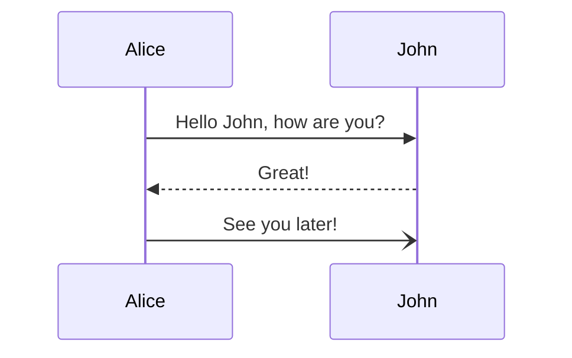
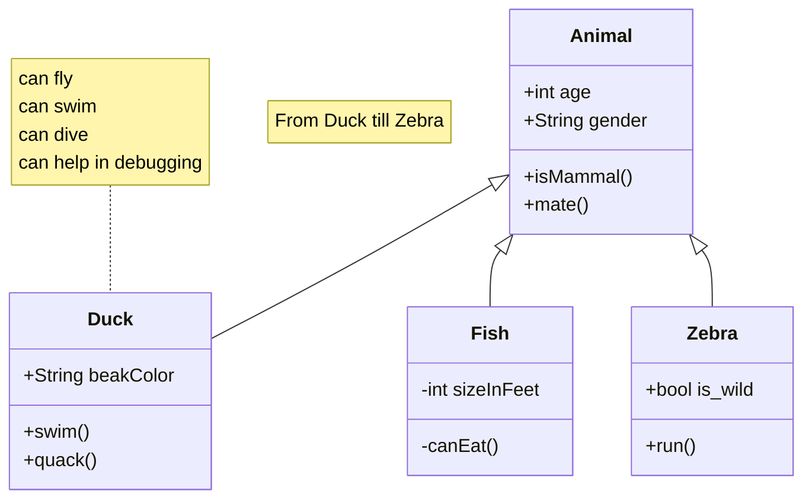
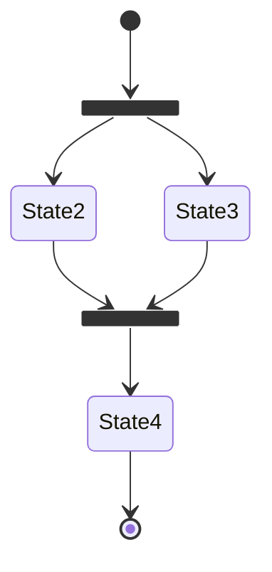

# Mermaid diagrams
[Mermaid](https://mermaid.ai/web/) lets you create diagrams and visualizations using text and code.

### Sequence diagram

```mermaid
sequenceDiagram
    Alice->>John: Hello John, how are you?
    John-->>Alice: Great!
    Alice-)John: See you later!
```

### Class diagram

```mermaid
classDiagram
  note "From Duck till Zebra"
  Animal <|-- Duck
  note for Duck "can fly<br>can swim<br>can dive<br>can help in debugging"
  Animal <|-- Fish
  Animal <|-- Zebra
  Animal : +int age
  Animal : +String gender
  Animal: +isMammal()
  Animal: +mate()
  class Duck{
      +String beakColor
      +swim()
      +quack()
  }
  class Fish{
      -int sizeInFeet
      -canEat()
  }
  class Zebra{
      +bool is_wild
      +run()
  }
```

### State diagram

```mermaid
stateDiagram-v2
  state fork_state <<fork>>
    [*] --> fork_state
    fork_state --> State2
    fork_state --> State3

    state join_state <<join>>
    State2 --> join_state
    State3 --> join_state
    join_state --> State4
    State4 --> [*]
```
